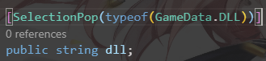

# 修改记录

**Version: 0.0.0**

* 建立项目
  * URP项目
  * [ECS Setup](https://docs.unity3d.com/Packages/com.unity.entities@1.0/manual/getting-started-installation.html)
  * [DOTS Setup](https://docs.unity3d.com/Packages/com.unity.entities@0.17/manual/install_setup.html)

* 文件夹
  * Res：资源
  * Plugins：插件
  * Scripts：脚本
    * Runtime：运行时
      * CSharp单例：Singleton
      * 其他单例：SystemBase
    * Editor：编辑器下代码
    * Test：测试

* 添加通用代码
  * Attribute
    * SelectionPop：常量数据的序列化

  * Common
    * GameData：数据
    * ISystem：System接口
    * Singleton：CSharp单例
