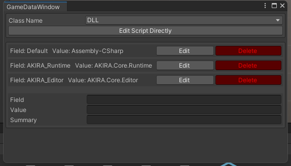
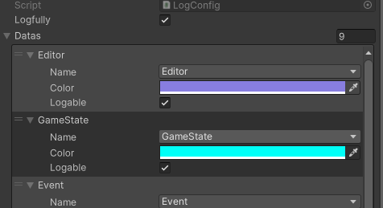
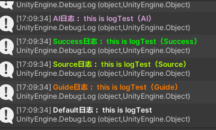
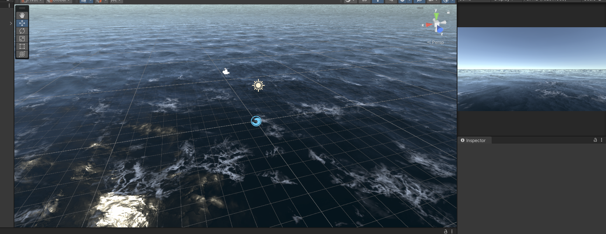

# 修改记录

**Version: 0.0.0**

* 建立项目
  * URP项目
  * [ECS Setup](https://docs.unity3d.com/Packages/com.unity.entities@1.0/manual/getting-started-installation.html)
  * [DOTS Setup](https://docs.unity3d.com/Packages/com.unity.entities@0.17/manual/install_setup.html)
* 文件夹
  * Res：资源
  * Plugins：插件
  * Scripts：脚本
    * Runtime：运行时
    * Editor：编辑器下代码
    * Test：测试
* 添加通用代码
  * Attribute
    * SelectionPop：常量数据的序列化
      
      
  * Common
    * GameData：数据
    * ISystem：System接口
    * Singleton：CSharp单例
  * Editor
    * GameDataWindow：后续添加内容，因为常量类写在程序集里面，方便后面就算不知道位置在那里也能修改和查看
      

**Version: 0.0.1**

* 日志管理
  * LogConfig
    * 日志颜色
    * 日志详细扩展
    * 是否打日志的bool选择
    * 配置的路径：Resources/Configs/LogConfig.Asset
      
      
  * LogSystem
    * 富文本日志
    * 双击日志跳转设置

**Version: 0.0.6**

* Unity-URP-WaterSystem
  * [WaterSystem](https://openupm.com/packages/com.unity.urp-water-system/#close)
    
  * 待学习。。
