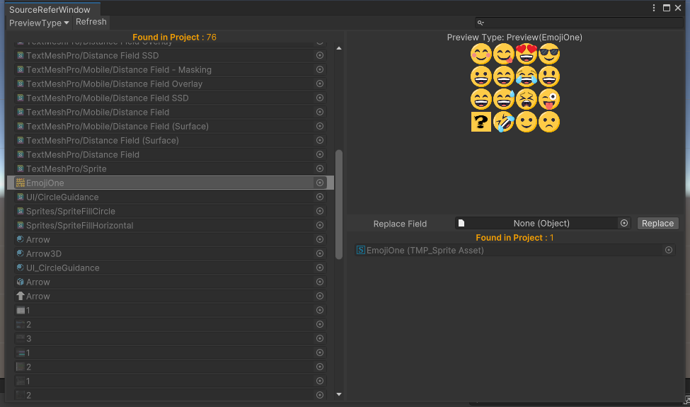

# 修改记录

**Version: 0.0.0**

* 建立项目
  * URP项目
  * [ECS Setup](https://docs.unity3d.com/Packages/com.unity.entities@1.0/manual/getting-started-installation.html)
  * [DOTS Setup](https://docs.unity3d.com/Packages/com.unity.entities@0.17/manual/install_setup.html)
* 文件夹
  * Res：资源
  * Plugins：插件
  * Scripts：脚本
    * Runtime：运行时
    * Editor：编辑器下代码
    * Test：测试
* 添加通用代码
  * Attribute
    * SelectionPop：常量数据的序列化  
        
      
  * Common
    * GameData：数据
    * ISystem：System接口
    * Singleton：CSharp单例
  * Editor
    * GameDataWindow：后续添加内容，因为常量类写在程序集里面，方便后面就算不知道位置在那里也能修改和查看  
      

**Version: 0.0.1**

* 日志管理
  * LogConfig
    * 日志颜色
    * 日志详细扩展
    * 是否打日志的bool选择
    * 配置的路径：Resources/Configs/LogConfig.Asset  
        
        
  * LogSystem
    * 富文本日志
    * 双击日志跳转设置

**Version: 0.0.4**

* 因为代码问题在 0.1.0 中删除，目前纯学习记录用
* ~~模块下载管理~~
  * ~~GitObject~~
    * ~~对应从Github页面抓取的json类~~
  * ~~ModuleDownloadConfig（存在局限）~~
    * ~~面板+Window获得路径~~  
        
    * ~~git路径必须带上 tree/[分支名]~~
    * ~~日志打印路径~~  
        
    * ~~Window显示Path所有节点~~  
        
    * ~~Check检查文件是否存在~~
    * ~~Download下载，按照git的目录下载到对应目录（图片以自己分支EventSystem为例）~~  
        
        
    * ~~加载以后LoadModule变成DeleteModule，可以一次性删除文件（在原来文件没有被移动的情况）~~  
        
    * ~~遗留问题（未解决）：下载之后提示InvalidOperationException: Stack empty.的报错，并且够不会isloaded的勾不会勾上~~
    * ~~还需要更多测试！~~

# 整合更新

**Version: 0.1.0**

* 更新记录
  * Excel2Json/Excel2Class  
    
    * 配置文件：`GameConfig.Instance.GetConfig<ExcelDataConfig>()`  
      内部判断路径是否正确问题，output必须是 `Resources` 文件夹或者 `StreamingAssets` 文件夹  
      `outputs path`: 需要转换output后手动点击`Refresh`按钮去刷新，`TableCollectionContorller`会进行加密检测和通过这些路径获得输出文件
    * excel表格式  
      |  ##param  |   param1   |  param2  |  param3  |  param4  |
      | :-------: | :--------: | :------: | :------: | :------: |
      |  ##type   |    int     |  string  |   bool   |   Enum   |
      | ##summary |  summary1  | summary2 | summary3 | summary4 |
      |    ##     |    xxx     |   ooo    |   xxx    |   ooo    |
      |    ##     | whatever## |          |   xxx    |   ooo    |
      |    ##     |            |          |   xxx    |   ooo    |
      |           |     1      |   "1"    |   true   |   Name   |
  * 统一ScriptObject文件：GameConfig  
      
    注：EditorConfigs不会打包进对应平台
    * 菜单目录 `Tools/AKIRA.Framework/Common/Select GameConfig` 可快速选择（如果存在）
    * 元素操作：移除，查看，移动
    * 代码获取方式 `GameConfig.Instance.GetConfig<T>()`
    * 2022版本好像会报错。。（实现在2021版本上）
  * 系统加载标签 `AKIRA.Attribute.SystemLauncherAttribute(int = 0)`
    * 添加标签默认在 `GameManager` 中实例化，标签类必须继承ISystem
    * 标签参数 `significance(重要程度) = 0` ，按照值进行排序实例化
  * 命令行面板 `ConsolePanel`
    * 用于游戏运行过程中作弊测试等
    * 配置呼出方法（对应页面，平台，唤醒按钮，关闭按钮）  
        
    * 配置命令行列表  
        
      * 在 `ConsoleSystem` 中去注册事件
  * 优化存档面板（操作按钮事件待补充）  
    
  * 分支测试时可以在场景空物体添加`TempLoader`脚本，在`OnSystemInitializeCompleted`事件结束后生成对应预制体
  * 尝试添加`Entity`，用`World`静态类管理`System`,`Controller`,`Entity`
    * `EntityBase`:带 `IUpdateCallback` 接口，如果继承类继承 `GameUpdate` 方法，面板会多出更新需要参数  
        
      注：此面板由 `UI Tool Kit` 绘制
    * `PoolEntityBase`:带 `IPool` 接口，更新在 `Task.Yield` 延迟后开始更新

**Version: 0.1.1**

* AB包管理
  * AB包面板 Unity官网面板  
      
  * AssetBundleConfig  
      
    * Simulation：编辑器下读取AB模拟运行，非勾选状态下直接AssetDataBase.LoadAsset
    * Use Web Request Test：给未来服务器下载准备，用WebRequest Url读取测试AB包
    * paths：AB包路径（暂停StreamingAssets下）
  * 简单测试PC和Android平台运行

**Version: 0.1.2**

* 指引
  * 配置面板  
      
  * 区分3D，2D
    * 脚本继承IGuide接口特殊处理（但也要配置在面板里）
    * 坑点待填：3D物体必须放在[Guidence]预制体下（考虑要不要去掉3D纯用IGuide接口替代）
  * xml存储

**Version: 0.1.3**

* SourceReferWindow
  * 资源引用查找及替换
  * 提供预览窗口和面板窗口，可以模糊查询资源
    * 预览窗口⬇  
      
    * 面板窗口⬇  
      
